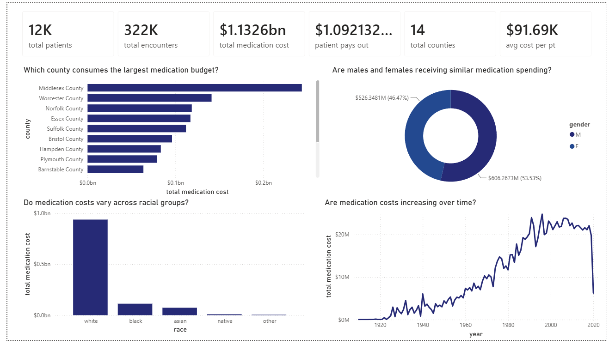
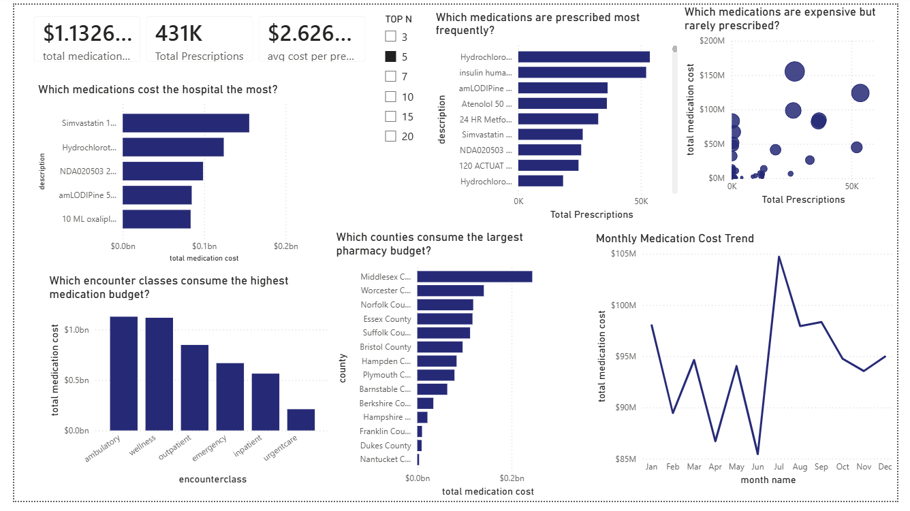
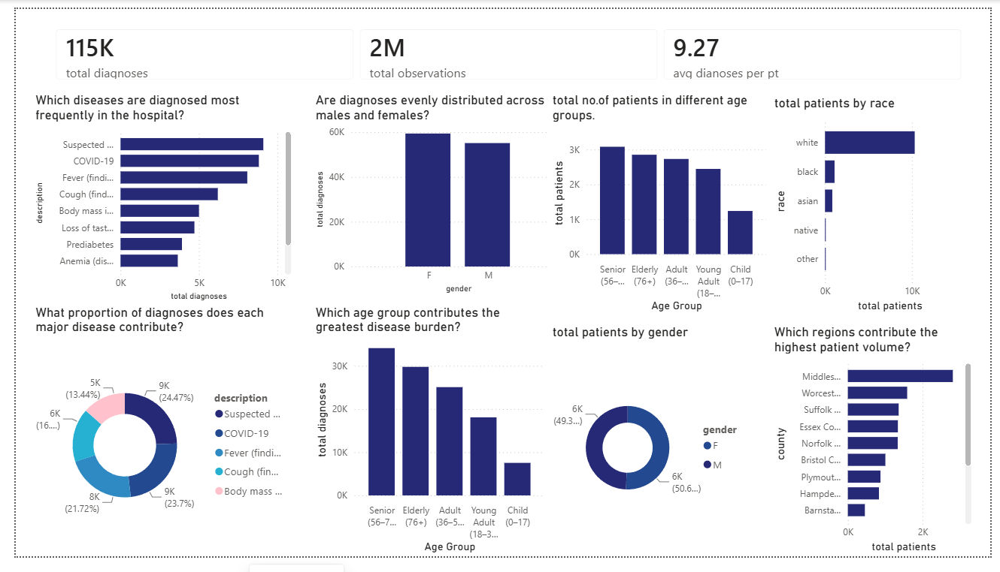
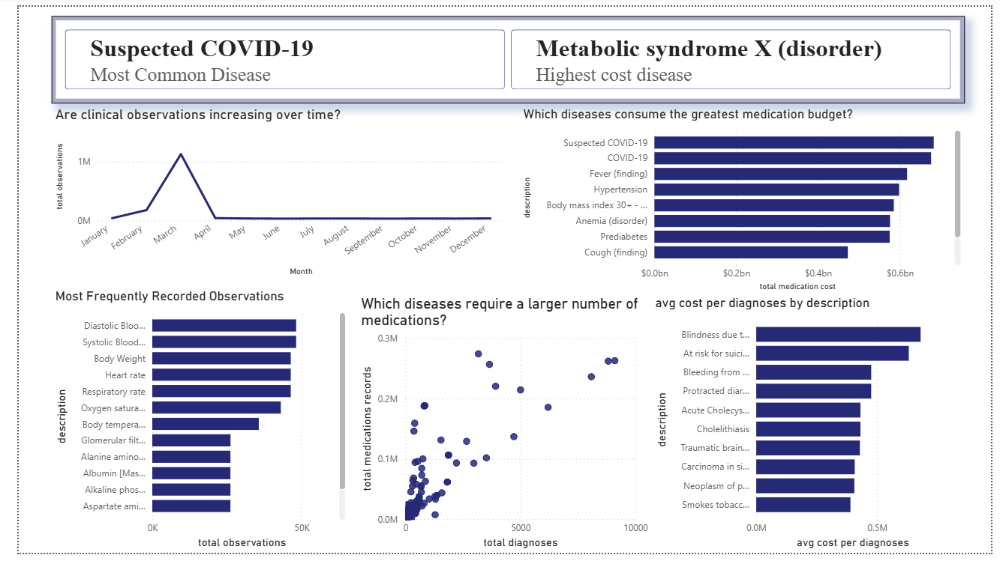
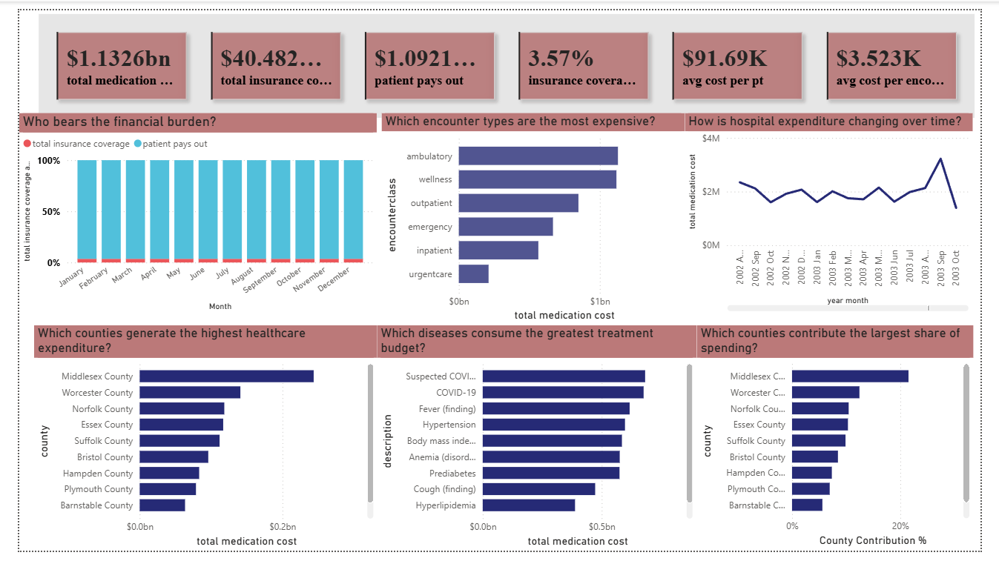

# 🏥 Healthcare Analytics Dashboard using Power BI

An end-to-end Healthcare Analytics Dashboard developed using **Microsoft Power BI**, **PostgreSQL**, and **DAX** to transform healthcare data into meaningful insights for hospital stakeholders.

---

# 📸 Dashboard Preview

## Executive Summary



---

## Pharmacy Analytics



---

## Clinical & Population Analytics

### Part 1



### Part 2



---

## Financial Analytics



---

# 📝 Project Overview

This project demonstrates the development of an end-to-end Healthcare Analytics Dashboard using Microsoft Power BI. The dashboard transforms healthcare data into interactive visualizations that support hospital executives, pharmacy managers, clinicians, and finance teams in making data-driven decisions.

The solution was built using the Synthea Synthetic Healthcare Dataset and focuses on four major business domains:

- Executive Reporting
- Pharmacy Analytics
- Clinical & Population Analytics
- Financial Analytics

---

# 🎯 Business Problem

Healthcare organizations generate large volumes of clinical, pharmacy, patient, and financial data. Without an interactive analytics platform, it becomes difficult to answer questions such as:

- Which diseases are diagnosed most frequently?
- Which medications contribute the highest treatment cost?
- Which counties generate the highest healthcare expenditure?
- How much do patients pay compared to insurance providers?
- Which encounter classes consume the greatest medication budget?

This dashboard answers these questions through interactive Power BI reports powered by DAX calculations.

---

# 📊 Dashboard Pages

## 1️⃣ Executive Summary

Provides a high-level overview of hospital performance.

### Key Metrics

- Total Patients
- Total Encounters
- Total Medication Cost
- Patient Out-of-Pocket Cost
- Average Cost per Patient
- County Performance
- Monthly Trends

---

## 2️⃣ Pharmacy Analytics

Provides detailed medication utilization and pharmacy expenditure analysis.

### Key Features

- Dynamic Top-N Medication Analysis
- Medication Cost Ranking
- Prescription Frequency
- Medication Cost by County
- Medication Cost by Encounter Class
- High Cost vs High Volume Medication Analysis

---

## 3️⃣ Clinical & Population Analytics

Analyzes disease burden and patient demographics.

### Key Features

- Top Diagnoses
- Disease Distribution
- Age Group Analysis
- Gender Distribution
- Race Distribution
- County Distribution
- Observation Trends
- Medication Cost by Disease
- Diagnosis vs Medication Analysis

---

## 4️⃣ Financial Analytics

Analyzes healthcare expenditure and financial performance.

### Key Features

- Total Medication Cost
- Insurance Coverage
- Patient Out-of-Pocket Cost
- Average Cost per Patient
- Average Cost per Encounter
- Healthcare Expenditure by County
- Medication Cost by Disease
- Monthly Financial Trends

---

# 🏗 Data Model

The dashboard follows a relational healthcare data model built using multiple interconnected tables.

### Tables Used

- Patients
- Encounters
- Medications
- Conditions
- Observations
- Calendar (Created in Power BI)

Relationships between these tables enable cross-filtering and interactive analytics across all dashboard pages.

---

# 🗂 Dataset

**Dataset Source**

Synthea Synthetic Healthcare Dataset

This synthetic Electronic Health Record (EHR) dataset enables healthcare analytics without exposing real patient information.

Additional dataset documentation is available here:

```text
dataset/dataset_description.md
```

---

# 🛠 Technologies Used

- Microsoft Power BI
- DAX (Data Analysis Expressions)
- PostgreSQL
- Power Query
- GitHub
- Synthea Synthetic Healthcare Dataset

---

# 📈 Key DAX Concepts Used

This project demonstrates the practical application of:

- CALCULATE()
- FILTER()
- ALL()
- VALUES()
- SUMX()
- AVERAGEX()
- RANKX()
- TOPN()
- SELECTEDVALUE()
- DIVIDE()
- VAR

---

# 💡 Key Business Insights

The dashboard enables healthcare stakeholders to:

- Identify the most frequently diagnosed diseases.
- Analyze disease burden across age, gender, race, and county.
- Identify high-cost medications and expensive disease treatments.
- Compare patient out-of-pocket expenses with insurance coverage.
- Analyze medication utilization across encounter classes.
- Monitor healthcare expenditure trends over time.
- Perform dynamic Top-N medication analysis using disconnected parameter tables.

---

# 📁 Repository Structure

```text
Healthcare-Analytics-Dashboard/
│
├── README.md
├── screenshots/
│   ├── executive-summary.png
│   ├── pharmacy-analytics.png
│   ├── clinical-analytics-part1.png
│   ├── clinical-analytics-part2.png
│   └── financial-analytics.png
│
├── dataset/
│   └── dataset_description.md
│
└── documentation/
    └── project_overview.pdf
```
## Power BI File

The PBIX file is not included in this repository because of GitHub file size limitations.

Dashboard screenshots and complete project documentation are available in this repository.

An interactive Power BI Service version will be added in the future.
---

# 🚀 Future Enhancements

- Integration with real Electronic Health Record (EHR) systems
- Predictive Healthcare Analytics
- Machine Learning for Disease Risk Prediction
- Real-time Dashboard Refresh
- Role-Based Security (Row-Level Security)
- Power BI Service Deployment

---

# 👤 Author

**Sahithya Thatikonda**

Pharm.D Student

Aspiring Healthcare Data Analyst

Interested in:

- Healthcare Analytics
- Clinical Research
- Pharmacovigilance
- Business Intelligence
- Data Visualization

---

# ⭐ How to Use

1. Download the Power BI (.pbix) file.
2. Open it using Microsoft Power BI Desktop.
3. Explore the four interactive dashboard pages.
4. Review the dataset documentation.
5. Refer to the project overview for implementation details.